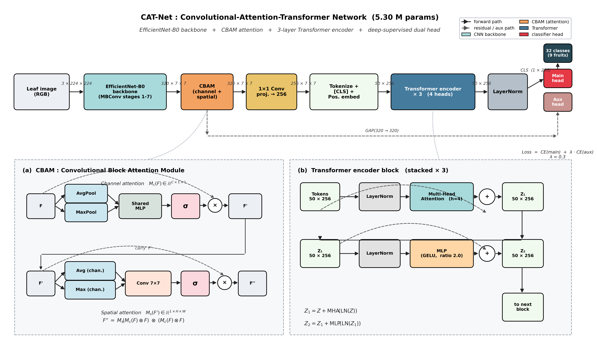

# CAT-Net-PlantCity

> **PlantCity-32: A Leakage-Free Multi-Fruit Benchmark for Plant Leaf Disease Classification with a Compact Convolutional-Attention-Transformer (CAT-Net).**

[](https://www.python.org/)
[](https://pytorch.org/)
[](LICENSE)

This repository contains the full code, leakage-free training pipeline, statistical evaluation, and reproducible figures for our benchmark on the **9-fruit, 32-class** subset of the [PlantCity dataset](https://doi.org/10.1016/j.dib.2025.112130) (Khan et al., *Data in Brief*, 2025). We:

1. **Document a previously unreported, dataset-wide data-leakage pattern** in PlantCity's recommended train/test split (every test image carries 1–4 augmented near-duplicates inside the train folder; mean 1.21 train copies / test image and 99.7 % match ratio across all 32 fruit-disease classes).
2. **Re-establish a leakage-free 5-fold stratified cross-validation protocol** on the 6 028 originals from PlantCity's `test/` partition.
3. **Propose CAT-Net** — a 5.30 M-parameter CNN-Attention-Transformer hybrid (EfficientNet-B0 stem + CBAM + 3 Transformer blocks + deep-supervised dual head).
4. **Benchmark six architectures** under 5-fold CV with paired McNemar significance, per-fruit failure analysis, corruption robustness, and CPU + GPU inference latency.
5. **Release a reproducible pipeline** that regenerates every table, figure, and statistical test from the trained checkpoints with a fixed seed.

---

## Headline results

### 5-fold stratified CV on 6 028 originals (mean ± std)

| Model | Params (M) | Accuracy | F1-macro | Precision | Recall |
|---|---:|---:|---:|---:|---:|
| ResNet-50 | 23.57 | 95.87 ± 0.25 | 95.47 ± 0.33 | 95.50 ± 0.31 | 95.68 ± 0.37 |
| DenseNet-121 | 6.99 | 95.94 ± 0.76 | 95.48 ± 0.79 | 95.55 ± 0.75 | 95.64 ± 0.85 |
| EfficientNet-B0 | 4.05 | 95.62 ± 1.27 | 95.13 ± 1.42 | 95.19 ± 1.59 | 95.42 ± 1.05 |
| MobileNetV3-L | 4.24 | 96.22 ± 0.43 | 95.94 ± 0.54 | 95.94 ± 0.50 | 96.16 ± 0.56 |
| ViT-B/16 | 85.82 | 95.72 ± 0.48 | 95.31 ± 0.42 | 95.40 ± 0.45 | 95.50 ± 0.42 |
| **CAT-Net (ours)** | **5.30** | **96.28 ± 0.42** | **96.03 ± 0.56** | **96.11 ± 0.63** | **96.14 ± 0.44** |

### Paired McNemar on out-of-fold predictions (continuity-corrected)

| Comparison | p-value | Verdict (α = 0.05) |
|---|---:|:---|
| CAT-Net vs EfficientNet-B0 | **0.0047** | CAT-Net significantly better |
| CAT-Net vs ViT-B/16 | **0.024** | CAT-Net significantly better |
| CAT-Net vs ResNet-50 | 0.094 | tied (numerically ahead) |
| CAT-Net vs DenseNet-121 | 0.139 | tied (numerically ahead) |
| CAT-Net vs MobileNetV3-L | 0.816 | tied |

### Inference latency (CPU x86 default; GPU RTX 3090)

| Model | CPU bs=1 (ms) | GPU bs=32 throughput (img s⁻¹) | Checkpoint (MB) |
|---|---:|---:|---:|
| ResNet-50 | 33.50 | 1 481 | 90.23 |
| DenseNet-121 | 153.63 | 1 331 | 27.21 |
| EfficientNet-B0 | 11.70 | 3 102 | 15.72 |
| **MobileNetV3-L** | **8.29** | **5 189** | 16.37 |
| ViT-B/16 | 105.71 | 421 | 327.44 |
| **CAT-Net (ours)** | **13.28** | 2 858 | **20.51** |

**Key finding.** CAT-Net is the **only model that is statistically significantly above ViT-B/16 and EfficientNet-B0 on mean macro-F1 under 5-fold CV**, while running **7.9× faster than ViT-B/16 on CPU** at **16× smaller on-disk size**. CAT-Net and MobileNetV3-Large are statistically tied on F1 (p = 0.82); MobileNet is faster, CAT-Net is more accurate by a hair, and both are deployment-ready under 25 MB.

---

## CAT-Net at a glance



```
Input 3×224×224
  → EfficientNet-B0 backbone (320×7×7)
  → CBAM (channel + spatial attention)
  → 1×1 conv → 256-d
  → 49 spatial tokens + [CLS] + learned positional embedding
  → 3 × Transformer encoder block (4-head MHA, MLP ratio 2.0)
  → LayerNorm
  → main head on the CLS token  +  aux head on global-pooled CBAM features
  → 32 classes (9 fruits)

Loss = CE(main) + 0.3 × CE(aux)
```

| Property | Value |
|---|---|
| Parameters | 5.30 M |
| Disk size | 20.5 MB |
| CPU latency (batch=1) | 13.3 ms (75 img s⁻¹) |
| GPU latency (batch=32) | 2 858 img s⁻¹ throughput |
| Speed-up vs ViT-B/16 (CPU) | 7.9× |
| On-disk reduction vs ViT-B/16 | 16× |

Architecture and implementation: [`experiments/models/catnet.py`](experiments/models/catnet.py).

---

## Repository layout

```
.
├── README.md                       ← you are here
├── LICENSE                         ← MIT
├── CITATION.cff                    ← academic citation
├── requirements.txt                ← pip dependencies
├── environment.yml                 ← optional conda spec
├── .gitignore
├── 1-s2.0-S2352340925008510-main.pdf   ← PlantCity dataset paper (Khan et al., 2025)
└── experiments/
    ├── config.py                   ← paths + hyperparameters (CROP=fruit switches the pipeline)
    ├── dataset.py                  ← stratified k-fold split builders
    ├── engine.py                   ← train / evaluate
    ├── models/
    │   ├── baselines.py            ← 5 timm wrappers
    │   └── catnet.py               ← CAT-Net implementation
    ├── run_all.py                  ← train orchestrator
    ├── run_catnet_only.py          ← single-model trainer
    ├── cv5_fold.py                 ← 5-fold CV training loop
    ├── cv5_aggregate.py            ← mean ± std + paired McNemar
    ├── leakage_audit_fruit.py      ← Section 2.2 dataset-wide audit
    ├── per_fruit_confusion.py      ← Section 5.1 per-fruit failure analysis
    ├── robustness.py               ← Section 5.2 corruption stress test
    ├── latency_bench.py            ← Section 5.3 CPU + GPU latency
    ├── summarize_fruit.py          ← headline tables + figures
    ├── fruit_paper_figures.py      ← CV bars, scatter, latency vs F1
    ├── paper_v2/
    │   ├── scripts/architecture_diagram_v2.py   ← Figure 1 generator
    │   └── figures/architecture_catnet_v2.{png,pdf}   ← Figure 1
    └── results/
        ├── checkpoints/            ← *.pt files (released separately, see "Checkpoints")
        ├── logs/                   ← per-model JSON training logs (+ fruit_cv/ for the 30 fold runs)
        ├── tables/fruit_*          ← all paper tables (.md + .csv + .tex)
        └── figures/fruit_*         ← all paper figures (.png)
```

---

## Setup

```bash
git clone https://github.com/ilhamisel/CAT-Net-PlantCity.git
cd CAT-Net-PlantCity
pip install -r requirements.txt
```

Requires a CUDA-capable GPU for training (we used an RTX 3090, 24 GB). Inference and figure regeneration run on CPU but are ≈ 10× slower.

### Dataset

PlantCity is not bundled with this repo. Download from the [Data in Brief article](https://doi.org/10.1016/j.dib.2025.112130) and place at `Images/{train,test}/<crop>_<class>/`. Only `Images/test/` is used to build the leakage-free CV folds; `Images/train/` is retained only for the leakage audit (Section 2.2).

### Checkpoints

The trained CV checkpoints (six models × five folds, ≈ 2.6 GB) are too large for the git tree. We release them via [GitHub Releases](https://github.com/ilhamisel/CAT-Net-PlantCity/releases) — download and place under `experiments/results/checkpoints/`.

---

## Reproduce

```bash
cd experiments
export CROP=fruit          # switches every script to the 9-fruit / 32-class pipeline

# 1. Dataset-wide leakage audit (Section 2.2)
/path/to/python leakage_audit_fruit.py

# 2. 5-fold CV training (Section 4) — six models × five folds, ≈ 12 h on RTX 3090
/path/to/python cv5_fold.py

# 3. Aggregate folds + paired McNemar (Section 4.2)
/path/to/python cv5_aggregate.py

# 4. Single-split headline training + per-fruit failure analysis (Section 5.1)
/path/to/python run_all.py clean
/path/to/python per_fruit_confusion.py

# 5. Robustness (Section 5.2) and latency (Section 5.3)
/path/to/python robustness.py
/path/to/python latency_bench.py

# 6. All paper figures + summary tables
/path/to/python summarize_fruit.py
/path/to/python fruit_paper_figures.py

# 7. Architecture diagram (Figure 1)
/path/to/python paper_v2/scripts/architecture_diagram_v2.py
```

All artefacts land under `experiments/results/tables/fruit_*` and `experiments/results/figures/fruit_*`. The architecture figure is written to `experiments/paper_v2/figures/architecture_catnet_v2.{png,pdf}`.

---

## Citation

If you use this code, the leakage-free CV protocol, or the CAT-Net architecture, please cite both PlantCity and our paper. A `CITATION.cff` is included for tooling.

```bibtex
@misc{catnet-plantcity-2026,
  title  = {PlantCity-32: A Leakage-Free Multi-Fruit Benchmark for
            Plant Leaf Disease Classification with a Compact
            Convolutional-Attention-Transformer (CAT-Net)},
  author = {<author list to be filled>},
  year   = {2026},
  howpublished = {\url{https://github.com/ilhamisel/CAT-Net-PlantCity}},
}

@article{khan2025plantcity,
  title   = {PlantCity: A comprehensive image based on multi crop leaves in Pakistan},
  author  = {Khan and Nisa and Ahmad and Zubair and Alshammari},
  journal = {Data in Brief},
  volume  = {63},
  pages   = {112130},
  year    = {2025},
  doi     = {10.1016/j.dib.2025.112130}
}
```

---

## License

Released under the MIT License. The bundled PlantCity dataset paper PDF (`1-s2.0-S2352340925008510-main.pdf`) remains © Elsevier — please refer to the original publication's terms.

---

## Acknowledgements

We thank the authors of the PlantCity dataset for releasing it under a permissive licence.
